# Fluid volume extraction

### **Input** : STL file
Input is an STL file that represents a solid object. "0. solid-volume.stl"

### **Output** : STL files
Output is a set of stl files 
1. fluid-volume-0.stl : Represents the largest fluid volume
2. fluid_wall-0.stl : Represents the fluid volume wall
3. fluid_inlets-outlets-combined-0.stl : Represents the inlets and outlets of the fluid volume in a single scene
4. fluid-inlet-outlet-0-0.stl : Represents a single inlet/outlet of the fluid volume in a separate scene
4. fluid-inlet-outlet-0-1.stl : Represents a single inlet/outlet of the fluid volume in a separate scene

### **Dependencies**
Create and activate venv:

```bash
python -m venv venv
```

Windows

```bash
venv\Scripts\activate
```

macOS/Linux

```bash
source venv/bin/activate
```

Then install:
```bash
pip install -r requirements.txt
```

### **Run**
To start the test run, copy-paste the following snippet

```bash
python -m unittest discover -s tests -p "test_*.py" -v
```

# def [Fluid region extraction()](https://github.com/paragpathak2006/test_water/blob/main/src/Fluid_region_extraction_algo/algo.py) (solid) → fluid:
This is the main baseline wrapper function that handles the full operation.

```
Fluid volume extraction : (CH(solid) - solid) → fluid
Fluid wall extraction : fluid ∩ solid → wall
Fluid inlet-outlet extraction : fluid - solid → inlets-outlets
```

A Input STL file is directly converted to output STL fluid volumes and boundaries by this function. Three operations happen internally. 
1. convex hull difference,
2. mesh surface intersection
3. mesh surface difference.

Operation 1 is a volume operation, and Operations 2 and 3 are surface operations.

```mermaid
graph LR;
    X(Baseline Convex hull Difference) --> A(convex hull difference);
    X --> B(mesh surface intersection);
    X --> C(mesh surface difference);
    style X fill:#111111,stroke:#333,stroke-width:4px
    style A fill:red,stroke:#333,stroke-width:4px
    style B fill:green,color:#fff
    style C fill:red,stroke:#333,stroke-width:4px
```



Code follows the following flow

```mermaid
graph LR;
    S[solid.stl] --> A(Baseline Convex hull Difference)
    A --> F[fluid.stl];
    style S fill:#111111,stroke:#333,stroke-width:4px
    style F fill:#111111,stroke:#333,stroke-width:4px
    style A fill:red,stroke:#333,stroke-width:4px
```



### def [convex hull difference](https://github.com/paragpathak2006/test_water/blob/main/src/Geometry/Convexhull_operations/convex_hull_difference/baseline.py)(solid) → Fluid cavities : 
This function takes a self-difference of the mesh with its own convex hull, and outputs an array of fluid cavity regions. 
```
Convex Hull (A) - A → B 
```

### def [mesh surface intersection](https://github.com/paragpathak2006/test_water/blob/main/src/Geometry/Mesh_operations/intersection_difference/baseline.py)(Mesh A, Mesh B)
This function is responsible for finding the intersection between two mesh surfaces, A and B. Output mesh C is a surface mesh that is the intersection between the two given meshes.
```
Mesh surfaces: A ∩ B → C
```

### def [mesh surface difference](https://github.com/paragpathak2006/test_water/blob/main/src/Geometry/Mesh_operations/intersection_difference/baseline.py)(Mesh A, Mesh B) 
This function is responsible for finding the difference between two mesh surfaces, A and B. Output mesh D is a surface mesh that is the difference between the two given meshes.
```
Mesh surfaces: A - B → D
```
