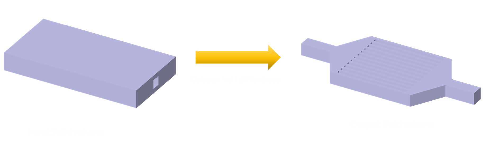
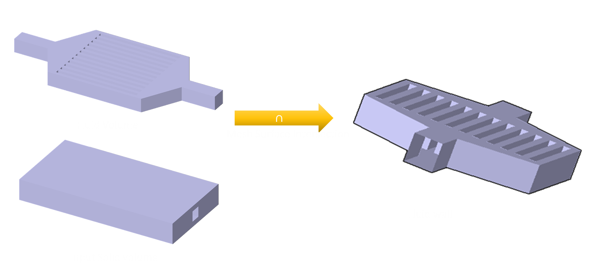
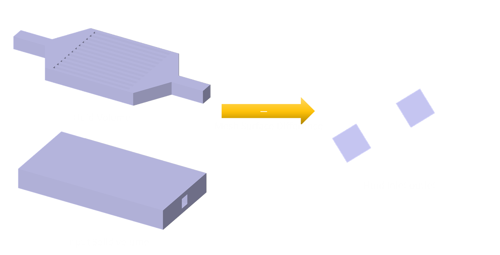
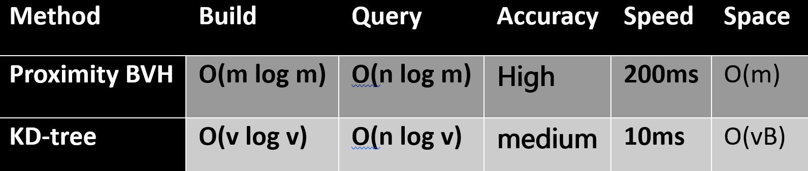

# Fluid volume extraction
Given a solid fluid volume, the task is to extract a fluid volume and surfaces from the solid.

## Approach
The convex hull difference algorithm was chosen, as we are dealing with internal fluid cavities, and the given solid part was in STL format. It is also more exact as compared to other volumetric voxel-based methods and works for many cases of fluid channel extraction. Many library functions are readily available for handling the algorithm 

## Algorithm Selection
High-level strategy for extraction using the convex hull difference algorithm involves three operations in the following order. 
1. convex hull difference,
2. mesh surface intersection
3. mesh surface difference.

The following notations are used
```
S(🟧)→solid volume
F(🟦)→fluid volume
IO(🟦)→fluid inlets and outlets
```
1. Fluid volume extraction via self-difference by convex hull : 

$$\text{Convex Hull}[S(🟧)] - S(🟧) → F(🟦)_0, F(🟦)_1...$$



2. One by one iterate over the list of concavities F(🟦)ᵢ
found in the solid volume.

3. Fluid wall extraction via intersection : 

$$F(🟦)_i ∩ S(🟧) → Wall(🟦)_i$$



4. Fluid inlet-outlet extraction via differences and splitting:

$$F(🟦)_i - S(🟧) → IO(🟦)_i$$



5. Split each IO set to get the inlets and outlets as separate

$$ IO(🟦)_i → IO(🟦)_{i,0} + IO(🟦)_{i,1} ... , IO(🟦)_{i,n}$$

6. To validate the fluid channel for the volume, ensure that the number of inlets and outlets are greater than or equal to two.

$$ n \geq 2 → \text{Valid fluid path} $$

## Implementation Details
Key design decisions, data structures used

### Fluid volume extraction
Trimesh library was used for convexhull extraction and volumetric Booleans. 

### Fluid boundary extraction
Sample performance Report from baseline algorithm is given below


| Baseline |  Δt  |
|:------|:-------|
| 📍 CHD | ⏰ 18.9536ms | 
| 📍 mesh (∩,Δ) - vol#0 | ⏰223.4202ms | 
| 📍 split - vol#0 | ⏰  2.4141ms | 

Since the main performance bottleneck was found to be the mesh intersection  algorithmm Three different implementations were attempted for the extracting boundary surfaces were compared in terms of performance

| Type |  Δt  |
|:------|:-------|
| 📍 Proximity query | ⏰ ~200ms | 
| 📍 Kdtree query | ⏰~15ms | 
| 📍 Hashmap implementation | ⏰  ~2-30ms | 

After extracting common faces, they were returned as lists. The uncommon faces were derived using Python’s numpy array difference function.

#### Proximity query
Proximity query was found to be quite accurate because it is more generic

#### KDtree query
KDtree query was a lot faster, but it needs a consistent topology in volumetric Boolean for the query to work with centroids.

#### Hashmaps 
Spatial indexing using HashMap were also relatively fast but required consistent topology between volumetric Booleans. The result was consistent with the Proximity query and required separate benchmarks. Output is also visibly different from the other two.

## Complexity Analysis
### Convex hull extraction
Calling mesh.convex_hull computes a 3D convex hull of the mesh vertices. Internally, trimesh delegates this to SciPy’s spatial hull implementation (which wraps Qhull). Complexity, therefore, follows standard 3D convex hull algorithms. 
```
n  → number of vertices and 
h  →  number of hull vertices.
```
- Time complexity: O(n log h). 
- Space complexity : O(n + h)

### Volumetric Boolean difference between convex hull and orignal part
- Time complexity: O(n log n) + O(h log h)
- Space complexity : O(n + h + s)

### Mesh surface intersections and difference for two meshes A and B
Since both operations require similar geometry and topology both these were united into a single operation to save computational time
```
- n → faces in mesh A
- m → faces in mesh B
- vB → vertices in mesh B
```



## Edge Cases
-   Surface meshes will fail the validation tests. 
-   Thin slices in inputs and differences that are below the tolerance volume would not be handled. 
-   Input as a convex hull will trigger an immediate test failure and will not be accepted. 
-   Self-Intersections in Meshes would fail the validation check as well.
## Testing Strategy
The Python unit tests module was used to ensure correctness, and performance was continuously being tested against benchmark results. 

### Correctness
Different algorithmic approaches were also compared to a baseline approach to ensure that performance and correctness don't degrade as the product gets upgraded with newer feature additions. The baseline folder stays stable ensuing a common reference point exists for any further addition of input parts.

| Algo| Proximity |KDtree | Hash Intersection |
|:------|:-------:|:-------:|:-------:|
|📍 CHD           | ✅|✅|✅|
|📍 mesh (∩,Δ )  |✅|🔧|🔧|
|📍 split  |✅|✅|✅|

#### Proximity correctness
The Proximity mesh intersection algorithm worked correctly and produced reasonably correct output by observations. 
#### KDtree correctness
The KDtree mesh intersection failed for 4 faces and needed a proximity as an additional check for limited faces. This happened because Booleans didn't preserve face topology for flat surface subtractions. Therefore, the centroids didn't match for those faces. Once fix was added it worked correctly to give valid results.

#### HashMap correctness
The hashmap mesh intersection also failed for the same reasons. When combined with a proximityQuery it worked correctly to give valid results. 

### Performance
The performance test revealed that the kdtree algorithm approach was found to be 10x faster than the baseline proximity approach. 

Event times for the following algorithms were tabulated

Event Times 

<!-- | 📍 CHD           |Δt = ⏰ 18.9536ms|
| 📍 mesh (∩,Δ) - vol#0  |Δt = ⏰223.4202ms|
| 📍 split - vol#0  |Δt = ⏰  2.4141ms|

| 📍 CHD            |Δt = ⏰  6.8467ms|
| 📍 mesh (∩,Δ) - vol#0  |Δt = ⏰ 14.7903ms|
| 📍 split - vol#0  |Δt = ⏰  1.3825ms|

| 📍 CHD  |Δt = ⏰  8.4248ms|
| 📍 mesh (∩,Δ) - vol#0  |Δt = ⏰ 28.9451ms|
| 📍 split - vol#0  |Δt = ⏰  1.6844ms| -->


| Baseline Algo          | Δt (ms) |
|:------|:-------|
| 📍 1️⃣ CHD                |   ⏰  14.3| 
| 📍 2️⃣ Mesh (∩,Δ) : 0    |   ⏰ 212.3|
| 📍 3️⃣ Split : 0         |   ⏰   2.2|
| 📍 Proximity Build     |   ⏰   1.1e-3|

| KDtree | Δt (ms)  |
|:------|:-------|
| 📍 1️⃣ CHD                  |   ⏰  13.1|
| 📍 2️⃣ Mesh (∩,Δ) : 0      |   ⏰  34.2|             
| 📍 3️⃣ Split : 0           |   ⏰   2.3|             
| 📍 Proximity Build       |   ⏰   1e-3|             
| 📍 KDTree Build          |   ⏰   0.2|             

| Hash Intersection Algo  | Δt (ms) |
|:------|:-------|
| 📍 1️⃣ CHD                    |  ⏰  11.3  |             
| 📍 2️⃣ Mesh (∩,Δ) : 0  Vertices       |  ⏰  38.8|             
| 📍 2️⃣ Mesh (∩,Δ) : 0  Centroidal       |  ⏰  10.6|             
| 📍 3️⃣ Split : 0             |  ⏰   1.2|     
| 📍 Proximity Build          |  ⏰   2.1e-3|             
| 📍 Hash table Build : Vertices               |  ⏰  22.8|             
| 📍 Hash table Build : Centroidal              |  ⏰  1.5 |             


### Github workflows for CI/CD
GitHub workflows were enabled for CI/CD to ensure performance, correctness, linting and formatting stay optimal throughout the product development cycle.

## Challenges
-   Deciding the libraries needed for convex hull differences was challenging, as different libraries had different implementations of the convex hull algorithms. 
-   The mesh surface operations like intersection and difference couldn't directly be performed on the Trimesh meshes, as the default implementations are made for water-tight volumes. So a custom implementation had to be designed for those specific operations. 
-   Implementing the unit testing infrastructure was also challenging, as performance for different variants had to be measured and tabulated, and a performance report needed to be generated. 

## Assumptions
- The assumptions were made that the ambient is of no interest to the final solution and will have a negligible impact on the region of interest. Also, excluding the ambient will enhance the performance of the CFD calculation. Therefore, this region hasn’t been included in the final fluid region output. 
- Geometry also needs to have a single largest fluid volume with at least two openings for detecting a channel.

## Validation

Input and output geometry are validated using checks post-operation to verify water-tight geometry and ensure positive volume and consistent normals.

The Trimesh property is_volume() was used that initiates a check consisting of the following four properties
1.  watertightness
2.  winding consistently
3.  Finiteness.
4.  Positive volume
Both inputs and outputs were validated using this check.

## Geometry Healing
If the geometry validation check failed, geometry healing was attempted on both the inputs and outputs.
## Trade-offs
- The Trimesh libraries were used to quickly create a baseline case for validation and saved development time. This, however, caused different mesh operations to be topologically and geometrically separate from each other, sacrificing performance. 
- In the interest of development time, the approach was more focused on performance measurement for different variants of an algorithm, rather than optimization and in-depth analysis of the performance and accuracy issues of different individual geometric queries. 
- The topological and geometric optimization that was performed was the merging of an intersection and difference query into a single operation, and ensured that both were using the same geometry and topology while performing the operation.

## Future Improvements
1. Currently, queries are using the geometry of the trimesh, and the inputs and outputs of different steps are topologically delinked. Bringing these different operations under a common topology will convert the intersection and difference operations into topological operations instead of geometric ones. 
2. Implementing custom C++ algorithms, building efficient spatial indexing using HashMap 
3. Converting the algorithms into SIMD algorithms can help utilize parallel architectures like CUDA for ultrafast computations.
4. Add additional test cases for effective testing of variants.

## Tool Selection
Libraries/frameworks chosen were 
-   Trimesh for convex hull and Boolean operations due to its popularity and ease of use.
-   Scipy for fast KDtree queries.


